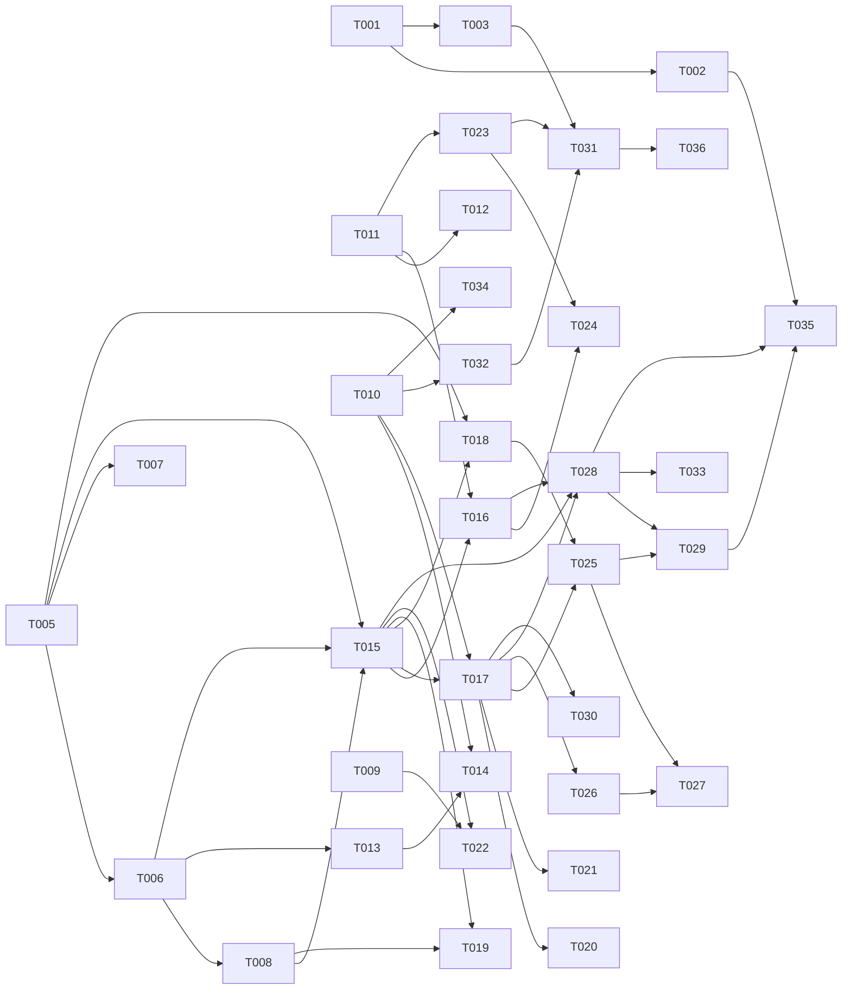

# DEPENDENCY-GRAPH

Standing: REGISTERED

```mermaid
graph LR
  T001 --> T002
  T001 --> T003
  T005 --> T006
  T005 --> T007
  T006 --> T008
  T011 --> T012
  T006 --> T013
  T010 --> T014
  T013 --> T014
  T005 --> T015
  T006 --> T015
  T008 --> T015
  T011 --> T016
  T015 --> T016
  T010 --> T017
  T015 --> T017
  T005 --> T018
  T015 --> T018
  T008 --> T019
  T015 --> T019
  T017 --> T020
  T017 --> T021
  T009 --> T022
  T015 --> T022
  T011 --> T023
  T023 --> T024
  T016 --> T024
  T017 --> T025
  T018 --> T025
  T017 --> T026
  T025 --> T027
  T026 --> T027
  T015 --> T028
  T016 --> T028
  T017 --> T028
  T025 --> T029
  T028 --> T029
  T017 --> T030
  T003 --> T031
  T023 --> T031
  T032 --> T031
  T010 --> T032
  T028 --> T033
  T010 --> T034
  T002 --> T035
  T028 --> T035
  T029 --> T035
  T031 --> T036
```

## See Also

INDEX.md
