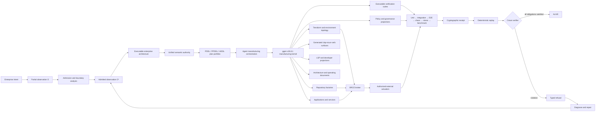
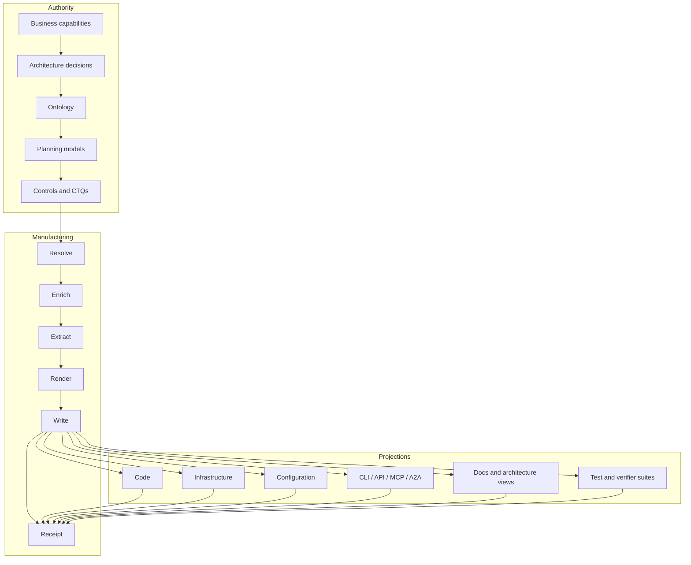

# Completed Fortune 5 Enterprise Manufacturing System

```mermaid
flowchart LR
  E[Enterprise intent] --> O[Partial observation O]
  O --> A1[Admission and boundary analysis]
  A1 --> OX[Admitted observation O*]
  OX --> EA[Executable enterprise architecture]
  EA --> KG[Unified semantic authority]
  KG --> PLAN[PDDL / PPDDL / HDDL plan portfolio]
  PLAN --> ORCH[Agent manufacturing orchestration]
  ORCH --> GEN[ggen v26.8.1 manufacturing kernel]

  GEN --> TF[Terraform and environment topology]
  GEN --> REPO[Repository factories]
  GEN --> APP[Applications and services]
  GEN --> CNV[Generated clap-noun-verb surfaces]
  GEN --> LSP[LSP and developer projections]
  GEN --> POLICY[Policy and governance projections]
  GEN --> DOCS[Architecture and operating documents]
  GEN --> TEST[Executable verification suites]

  TF --> BROKER[BRCE broker]
  REPO --> BROKER
  APP --> BROKER
  BROKER --> ACT[Authorized external actuation]

  TEST --> VERIFY[Unit → integration → E2E → chaos → stress → benchmark]
  POLICY --> VERIFY
  ACT --> VERIFY
  VERIFY --> RECEIPT[Cryptographic receipt]
  RECEIPT --> REPLAY[Deterministic replay]
  REPLAY --> CROWN{Crown verifier}
  CROWN -->|all obligations satisfied| ALIVE[ALIVE]
  CROWN -->|violation| REFUSE[Typed refusal]
  REFUSE --> REPAIR[Diagnose and repair]
  REPAIR --> OX
```

## Software-production-system closure

```mermaid
flowchart TB
  subgraph Authority
    BIZ[Business capabilities]
    ARCH[Architecture decisions]
    ONT[Ontology]
    PDDL[Planning models]
    CTRL[Controls and CTQs]
  end

  subgraph Manufacturing
    RES[Resolve]
    ENR[Enrich]
    EXT[Extract]
    REN[Render]
    WRI[Write]
    REC[Receipt]
  end

  subgraph Projections
    CODE[Code]
    INFRA[Infrastructure]
    CFG[Configuration]
    API[CLI / API / MCP / A2A]
    VIEWS[Docs and architecture views]
    SUITES[Test and verifier suites]
  end

  BIZ --> ARCH --> ONT --> PDDL --> CTRL
  CTRL --> RES --> ENR --> EXT --> REN --> WRI --> REC
  WRI --> CODE
  WRI --> INFRA
  WRI --> CFG
  WRI --> API
  WRI --> VIEWS
  WRI --> SUITES
  CODE & INFRA & CFG & API & VIEWS & SUITES --> REC
```
