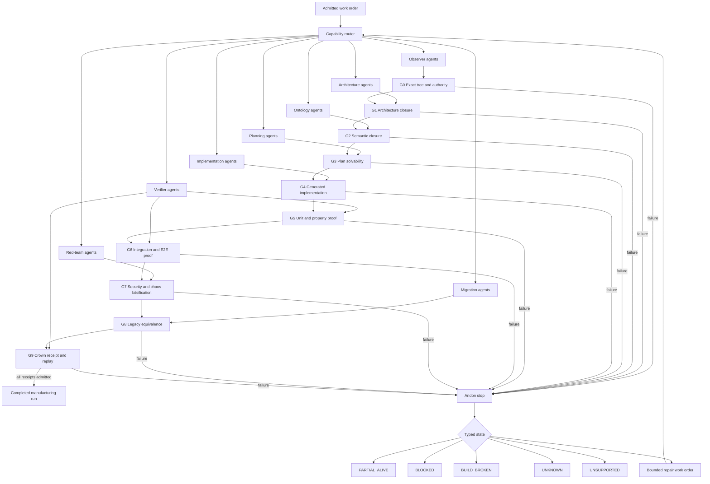
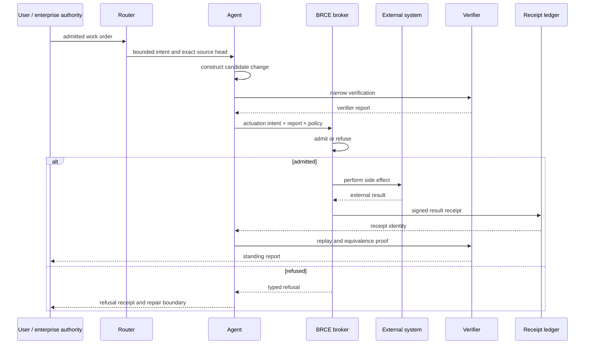

# Completed Agent Fleet and Gall Control Plane

```mermaid
flowchart TB
  CMD[Admitted work order] --> ROUTER[Capability router]
  ROUTER --> OBS[Observer agents]
  ROUTER --> ARCH[Architecture agents]
  ROUTER --> ONT[Ontology agents]
  ROUTER --> PLAN[Planning agents]
  ROUTER --> IMPL[Implementation agents]
  ROUTER --> VER[Verifier agents]
  ROUTER --> MIG[Migration agents]
  ROUTER --> RED[Red-team agents]

  OBS --> G0[G0 Exact tree and authority]
  ARCH --> G1[G1 Architecture closure]
  ONT --> G2[G2 Semantic closure]
  PLAN --> G3[G3 Plan solvability]
  IMPL --> G4[G4 Generated implementation]
  VER --> G5[G5 Unit and property proof]
  VER --> G6[G6 Integration and E2E proof]
  RED --> G7[G7 Security and chaos falsification]
  MIG --> G8[G8 Legacy equivalence]
  VER --> G9[G9 Crown receipt and replay]

  G0 --> G1 --> G2 --> G3 --> G4 --> G5 --> G6 --> G7 --> G8 --> G9
  G9 -->|all receipts admitted| DONE[Completed manufacturing run]
  G0 & G1 & G2 & G3 & G4 & G5 & G6 & G7 & G8 & G9 -->|failure| ANDON[Andon stop]
  ANDON --> CLASSIFY{Typed state}
  CLASSIFY --> PARTIAL[PARTIAL_ALIVE]
  CLASSIFY --> BLOCKED[BLOCKED]
  CLASSIFY --> BROKEN[BUILD_BROKEN]
  CLASSIFY --> UNKNOWN[UNKNOWN]
  CLASSIFY --> UNSUP[UNSUPPORTED]
  CLASSIFY --> REPAIR[Bounded repair work order]
  REPAIR --> ROUTER
```

## Zero-unreceipted-actuation agent protocol

```mermaid
sequenceDiagram
  participant U as User / enterprise authority
  participant R as Router
  participant A as Agent
  participant B as BRCE broker
  participant X as External system
  participant V as Verifier
  participant L as Receipt ledger

  U->>R: admitted work order
  R->>A: bounded intent and exact source head
  A->>A: construct candidate change
  A->>V: narrow verification
  V-->>A: verifier report
  A->>B: actuation intent + report + policy
  B->>B: admit or refuse
  alt admitted
    B->>X: perform side effect
    X-->>B: external result
    B->>L: signed result receipt
    L-->>A: receipt identity
    A->>V: replay and equivalence proof
    V-->>U: standing report
  else refused
    B-->>A: typed refusal
    A-->>U: refusal receipt and repair boundary
  end
```
