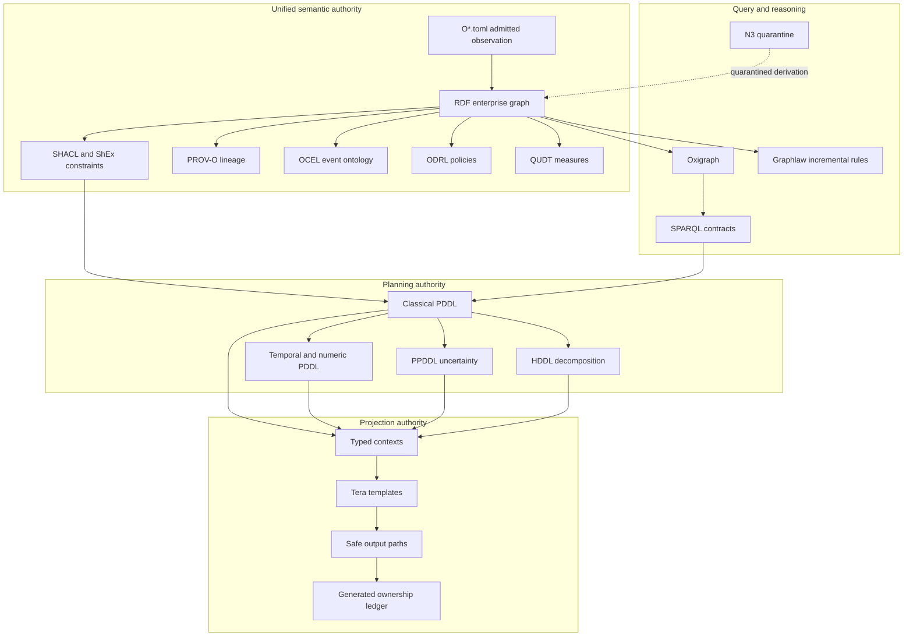
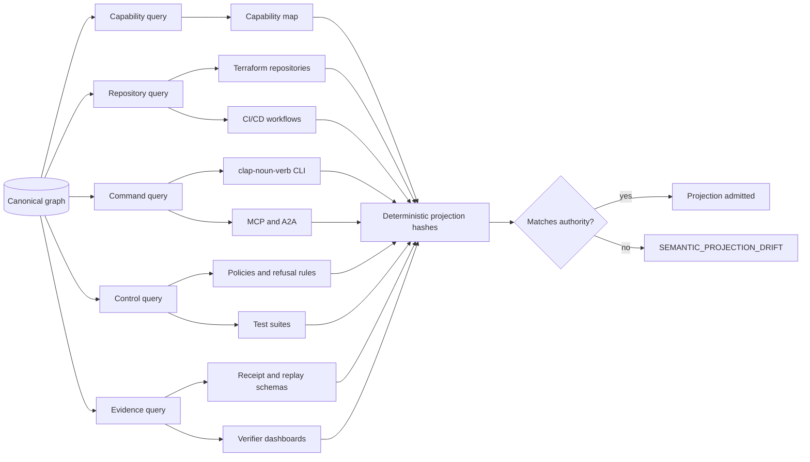

# Completed Unified Semantic Control Plane

```mermaid
flowchart TB
  subgraph SemanticAuthority[Unified semantic authority]
    OSTAR[O*.toml admitted observation]
    RDF[RDF enterprise graph]
    SHACL[SHACL and ShEx constraints]
    PROV[PROV-O lineage]
    OCEL[OCEL event ontology]
    ODRL[ODRL policies]
    QUDT[QUDT measures]
  end

  subgraph QueryAndReasoning[Query and reasoning]
    OXI[Oxigraph]
    GL[Graphlaw incremental rules]
    SPARQL[SPARQL contracts]
    N3[N3 quarantine]
  end

  subgraph Planning[Planning authority]
    CLASSICAL[Classical PDDL]
    TEMP[Temporal and numeric PDDL]
    PROB[PPDDL uncertainty]
    HTN[HDDL decomposition]
  end

  subgraph Projection[Projection authority]
    TERA[Tera templates]
    BIND[Typed contexts]
    PATH[Safe output paths]
    OWN[Generated ownership ledger]
  end

  OSTAR --> RDF
  RDF --> SHACL
  RDF --> PROV
  RDF --> OCEL
  RDF --> ODRL
  RDF --> QUDT
  RDF --> OXI --> SPARQL
  RDF --> GL
  N3 -. quarantined derivation .-> RDF
  SHACL --> CLASSICAL
  SPARQL --> CLASSICAL
  CLASSICAL --> TEMP
  CLASSICAL --> PROB
  CLASSICAL --> HTN
  CLASSICAL & TEMP & PROB & HTN --> BIND
  BIND --> TERA --> PATH --> OWN
```

## One authority, many governed projections

```mermaid
flowchart LR
  AUTH[(Canonical graph)] --> Q1[Capability query]
  AUTH --> Q2[Repository query]
  AUTH --> Q3[Command query]
  AUTH --> Q4[Control query]
  AUTH --> Q5[Evidence query]

  Q1 --> CAP[Capability map]
  Q2 --> TF[Terraform repositories]
  Q2 --> CI[CI/CD workflows]
  Q3 --> CNV[clap-noun-verb CLI]
  Q3 --> MCP[MCP and A2A]
  Q4 --> POL[Policies and refusal rules]
  Q4 --> TEST[Test suites]
  Q5 --> REC[Receipt and replay schemas]
  Q5 --> DASH[Verifier dashboards]

  CAP & TF & CI & CNV & MCP & POL & TEST & REC & DASH --> HASH[Deterministic projection hashes]
  HASH --> DRIFT{Matches authority?}
  DRIFT -->|yes| ADMIT[Projection admitted]
  DRIFT -->|no| REFUSE[SEMANTIC_PROJECTION_DRIFT]
```
