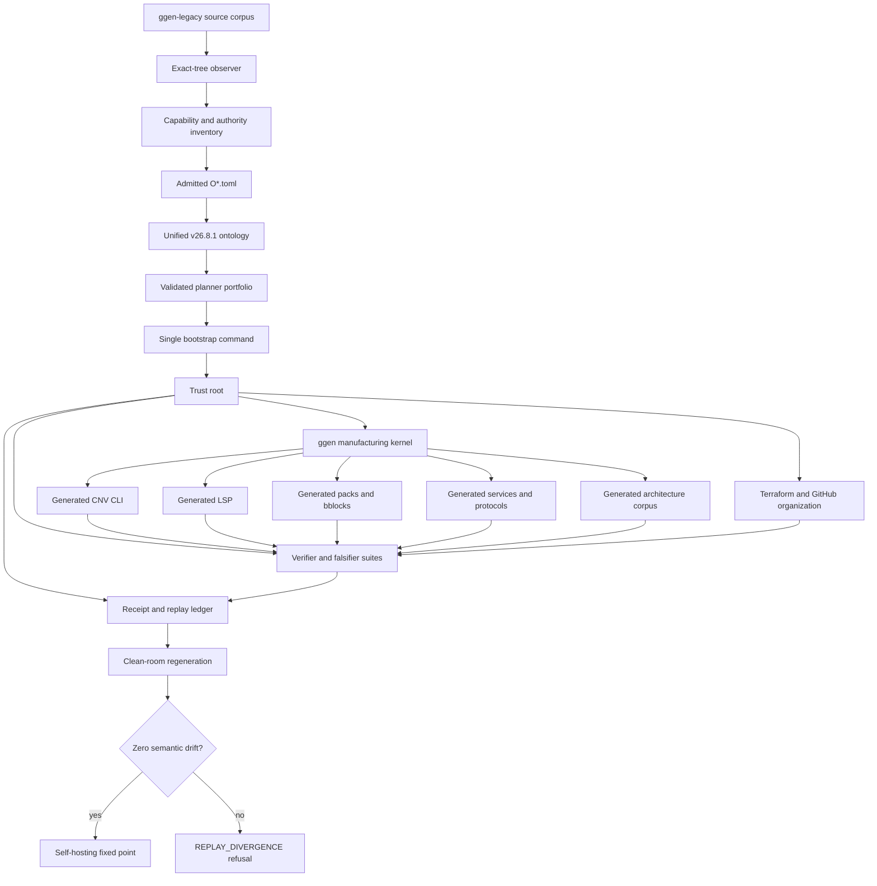
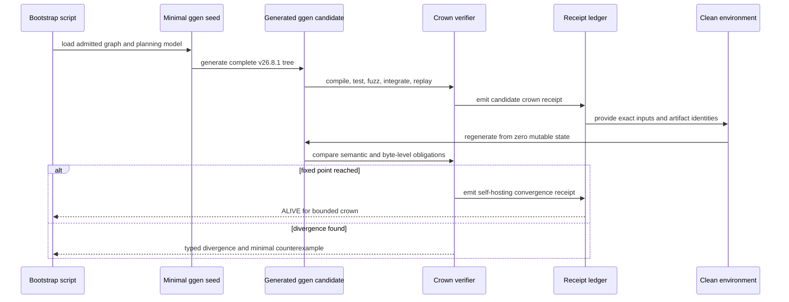

# Completed ggen v26.8.1 Self-Manufacture

```mermaid
flowchart TB
  LEGACY[ggen-legacy source corpus] --> OBS[Exact-tree observer]
  OBS --> INV[Capability and authority inventory]
  INV --> OSTAR[Admitted O*.toml]
  OSTAR --> ONT[Unified v26.8.1 ontology]
  ONT --> PLAN[Validated planner portfolio]
  PLAN --> BOOT[Single bootstrap command]

  BOOT --> ROOT[Trust root]
  ROOT --> INFRA[Terraform and GitHub organization]
  ROOT --> KERNEL[ggen manufacturing kernel]
  ROOT --> VERIFY[Verifier and falsifier suites]
  ROOT --> EVID[Receipt and replay ledger]

  KERNEL --> CLI[Generated CNV CLI]
  KERNEL --> LSP[Generated LSP]
  KERNEL --> PACKS[Generated packs and bblocks]
  KERNEL --> SERVICES[Generated services and protocols]
  KERNEL --> DOCS[Generated architecture corpus]

  CLI & LSP & PACKS & SERVICES & DOCS --> VERIFY
  INFRA --> VERIFY
  VERIFY --> EVID
  EVID --> REGEN[Clean-room regeneration]
  REGEN --> DIFF{Zero semantic drift?}
  DIFF -->|yes| FIXED[Self-hosting fixed point]
  DIFF -->|no| STOP[REPLAY_DIVERGENCE refusal]
```

## Recursive convergence sequence

```mermaid
sequenceDiagram
  participant S as Bootstrap script
  participant G0 as Minimal ggen seed
  participant G1 as Generated ggen candidate
  participant V as Crown verifier
  participant R as Receipt ledger
  participant C as Clean environment

  S->>G0: load admitted graph and planning model
  G0->>G1: generate complete v26.8.1 tree
  G1->>V: compile, test, fuzz, integrate, replay
  V->>R: emit candidate crown receipt
  R->>C: provide exact inputs and artifact identities
  C->>G1: regenerate from zero mutable state
  G1->>V: compare semantic and byte-level obligations
  alt fixed point reached
    V->>R: emit self-hosting convergence receipt
    R-->>S: ALIVE for bounded crown
  else divergence found
    V-->>S: typed divergence and minimal counterexample
  end
```
