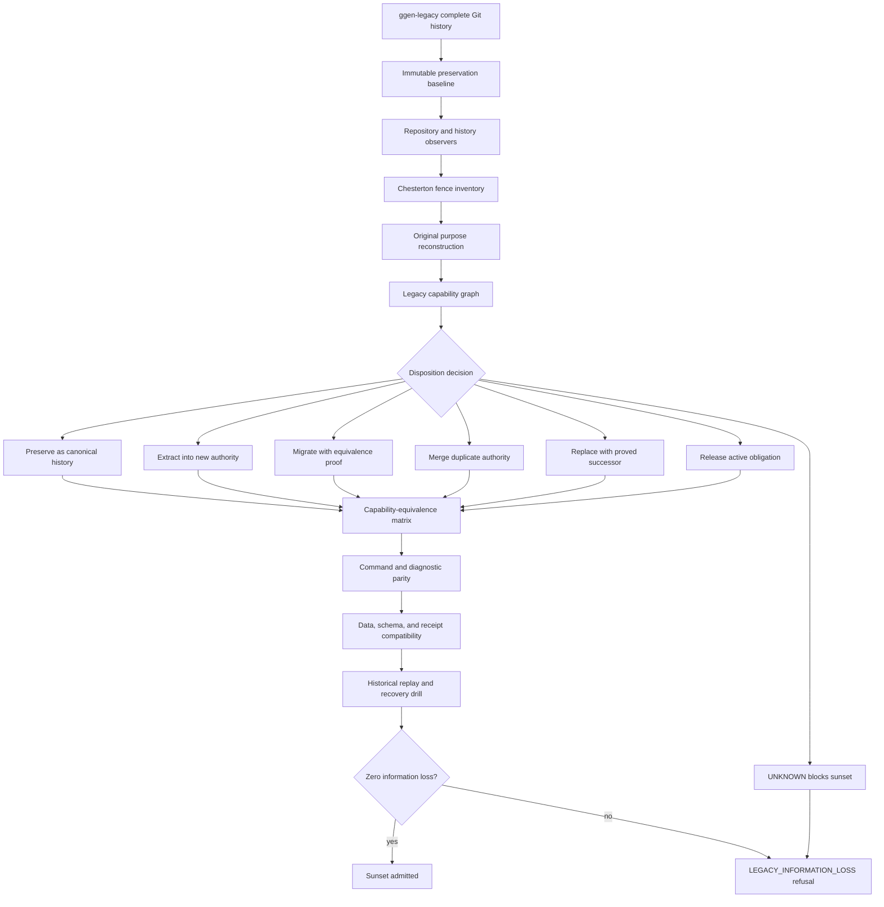
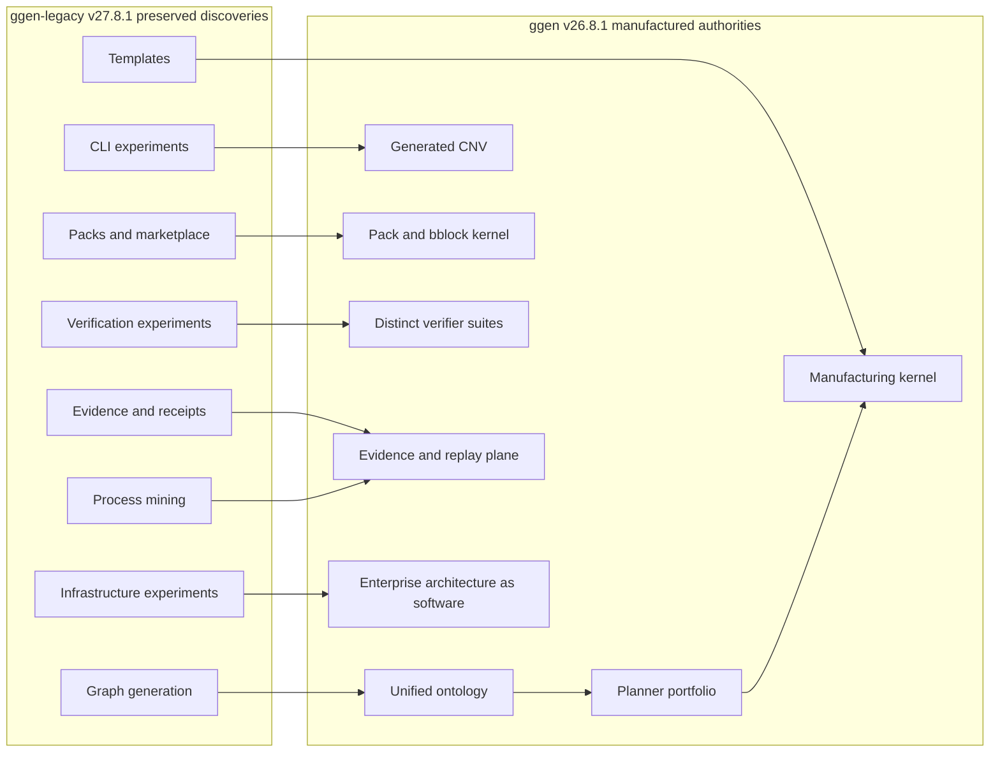

# Completed ggen-legacy v27.8.1 Transformation and Sunset

`ggen-legacy v27.8.1` is modeled here as the final preservation and migration release: every historical fence is explained, every capability receives a disposition, and the repository becomes a replayable research corpus.

## Legacy-to-manufacturing lineage

