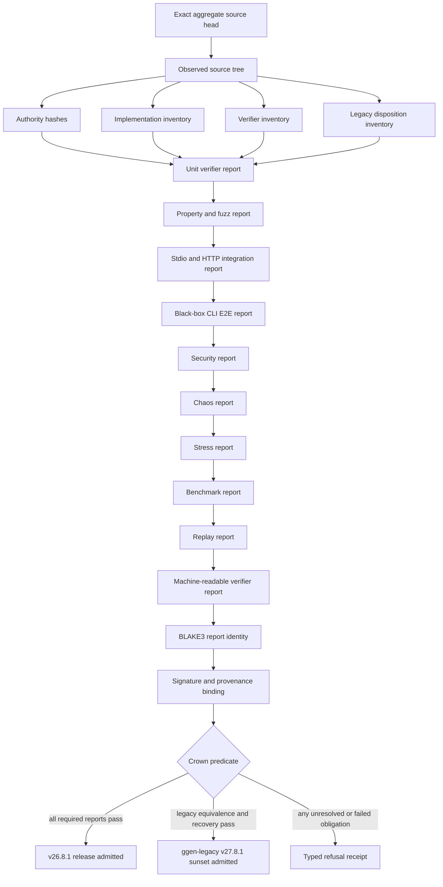
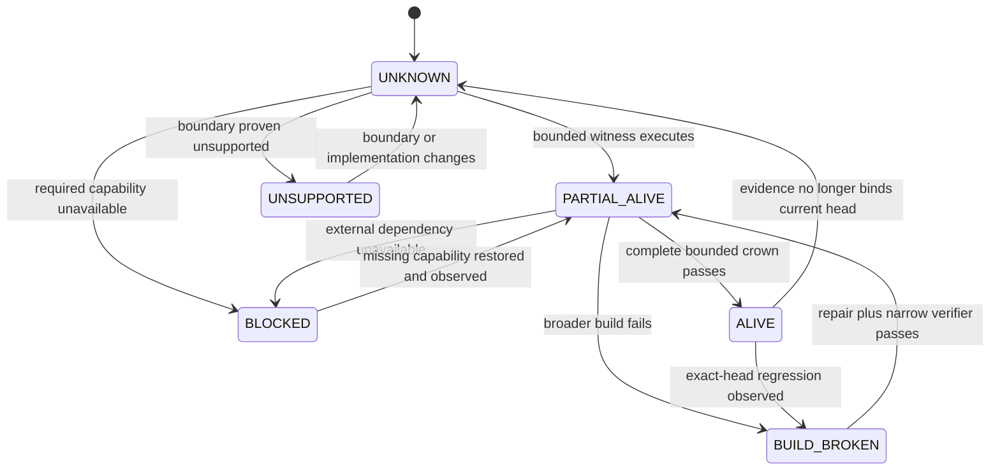
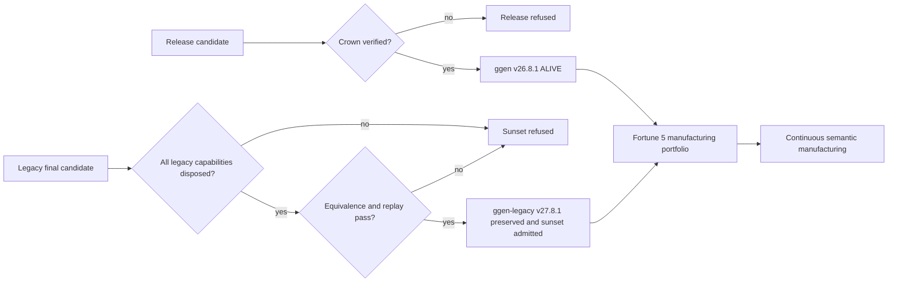

# Completed Crown, Receipt, and Replay Architecture

```mermaid
flowchart TB
  HEAD[Exact aggregate source head] --> OBS[Observed source tree]
  OBS --> AUTH[Authority hashes]
  OBS --> IMPL[Implementation inventory]
  OBS --> TESTS[Verifier inventory]
  OBS --> LEG[Legacy disposition inventory]

  AUTH & IMPL & TESTS & LEG --> UNIT[Unit verifier report]
  UNIT --> PROP[Property and fuzz report]
  PROP --> INT[Stdio and HTTP integration report]
  INT --> E2E[Black-box CLI E2E report]
  E2E --> SEC[Security report]
  SEC --> CHAOS[Chaos report]
  CHAOS --> STRESS[Stress report]
  STRESS --> BENCH[Benchmark report]
  BENCH --> REPLAY[Replay report]

  REPLAY --> MR[Machine-readable verifier report]
  MR --> HASH[BLAKE3 report identity]
  HASH --> SIGN[Signature and provenance binding]
  SIGN --> CROWN{Crown predicate}

  CROWN -->|all required reports pass| RELEASE[v26.8.1 release admitted]
  CROWN -->|legacy equivalence and recovery pass| SUNSET[ggen-legacy v27.8.1 sunset admitted]
  CROWN -->|any unresolved or failed obligation| REFUSED[Typed refusal receipt]
```

## Final standing state machine

```mermaid
stateDiagram-v2
  [*] --> UNKNOWN
  UNKNOWN --> PARTIAL_ALIVE: bounded witness executes
  UNKNOWN --> BLOCKED: required capability unavailable
  UNKNOWN --> UNSUPPORTED: boundary proven unsupported
  PARTIAL_ALIVE --> BUILD_BROKEN: broader build fails
  PARTIAL_ALIVE --> BLOCKED: external dependency unavailable
  PARTIAL_ALIVE --> ALIVE: complete bounded crown passes
  BUILD_BROKEN --> PARTIAL_ALIVE: repair plus narrow verifier passes
  BLOCKED --> PARTIAL_ALIVE: missing capability restored and observed
  ALIVE --> BUILD_BROKEN: exact-head regression observed
  ALIVE --> UNKNOWN: evidence no longer binds current head
  UNSUPPORTED --> UNKNOWN: boundary or implementation changes
```

## Completed release and sunset decision

```mermaid
flowchart LR
  R0[Release candidate] --> RC{Crown verified?}
  RC -->|no| RR[Release refused]
  RC -->|yes| R1[ggen v26.8.1 ALIVE]

  L0[Legacy final candidate] --> LC{All legacy capabilities disposed?}
  LC -->|no| LR[Sunset refused]
  LC -->|yes| EQ{Equivalence and replay pass?}
  EQ -->|no| LR
  EQ -->|yes| L1[ggen-legacy v27.8.1 preserved and sunset admitted]

  R1 --> PORT[Fortune 5 manufacturing portfolio]
  L1 --> PORT
  PORT --> NEXT[Continuous semantic manufacturing]
```
